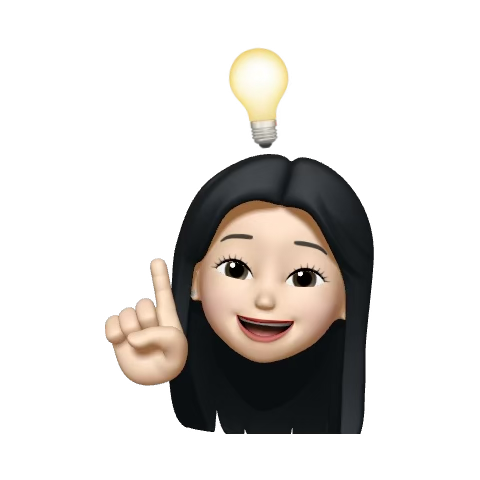

<div align="center">

<picture>
  <source media="(prefers-color-scheme: dark)" srcset="./assets/header-dark.svg">
  <source media="(prefers-color-scheme: light)" srcset="./assets/header-light.svg">
  
</picture>

<br>

# `jmin0727`

### ML Engineer in progress

**AI · Machine Learning · Deep Learning · Computer Vision · MLOps**

<br>

<a href="https://github.com/jmin0727">
  
</a>
&nbsp;

&nbsp;


</div>

<br>

---

<div align="center">

## `01` — WHO I AM

### **Building AI systems beyond the notebook.**

</div>

<table>
<tr>

<td width="60%" valign="top">

### 🧑‍💻 About Me

I'm building my foundation as an **ML Engineer**.

I’m interested in the full machine learning lifecycle:

**Data → Model → Service → Production**

I enjoy understanding not only **how to train a model**, but also how to make it reproducible, deployable, and maintainable.

<br>

> **Learn deeply. Build deliberately. Improve continuously.**

</td>

<td width="40%" valign="middle" align="center">



<br>

### `FOCUS`

<br>

🤖 **Machine Learning**

🧠 **Deep Learning**

👁️ **Computer Vision**

⚙️ **MLOps**

🚀 **AI Engineering**

</td>

</tr>
</table>

<br>

<div align="center">


</div>

<br>

---

<div align="center">

## `02` — ENGINEERING MINDSET

<br>

<table align="center" width="92%">
<tr>

<td width="25%" align="center" valign="top">

### `01`

<br>

🔍

<br><br>

<sub><b>UNDERSTAND</b></sub>

<br><br>

<sub>
Problem<br>
Data
</sub>

<br><br><br>

</td>

<td width="25%" align="center" valign="top">

### `02`

<br>

🧪

<br><br>

<sub><b>EXPERIMENT</b></sub>

<br><br>

<sub>
Train<br>
Evaluate
</sub>

<br><br><br>

</td>

<td width="25%" align="center" valign="top">

### `03`

<br>

🚀

<br><br>

<sub><b>DEPLOY</b></sub>

<br><br>

<sub>
Model<br>
Service
</sub>

<br><br><br>

</td>

<td width="25%" align="center" valign="top">

### `04`

<br>

⚙️

<br><br>

<sub><b>IMPROVE</b></sub>

<br><br>

<sub>
Monitor<br>
Iterate
</sub>

<br><br><br>

</td>

</tr>
</table>

<br>


<br><br>

```text
UNDERSTAND  →  EXPERIMENT  →  DEPLOY  →  IMPROVE
```

</div>

<br>

---

<div align="center">

## `03` — TECH STACK

<br>

### Languages & Data


<br><br>

### AI / Machine Learning


<br><br>

### Engineering & MLOps


<br><br>


</div>

<br>

---

<div align="center">

## `04` — ML LIFECYCLE

<br>

<table align="center" width="92%">
<tr>

<td align="center" width="14%">

### `01`

**Problem**

</td>

<td align="center" width="14%">

→

</td>

<td align="center" width="14%">

### `02`

**Data**

</td>

<td align="center" width="14%">

→

</td>

<td align="center" width="14%">

### `03`

**Model**

</td>

<td align="center" width="14%">

→

</td>

<td align="center" width="14%">

### `04`

**Evaluate**

</td>

</tr>

<tr>

<td colspan="7" align="center">

<br>

⬇

<br><br>

### **Deploy → Monitor → Improve**

</td>

</tr>
</table>

<br>


</div>

<br>

---

<div align="center">

## `05` — GITHUB SNAPSHOT

<br>

<picture>
  <source
    media="(prefers-color-scheme: dark)"
    srcset="https://github-readme-stats.vercel.app/api?username=jmin0727&show_icons=true&hide_border=true&theme=dark&bg_color=00000000&title_color=9B8CFF&icon_color=00E5B0&text_color=C9D1D9"
  >
  <source
    media="(prefers-color-scheme: light)"
    srcset="https://github-readme-stats.vercel.app/api?username=jmin0727&show_icons=true&hide_border=true&theme=default&bg_color=00000000&title_color=6657E8&icon_color=00A98F&text_color=24292F"
  >
  
</picture>

<picture>
  <source
    media="(prefers-color-scheme: dark)"
    srcset="https://github-readme-stats.vercel.app/api/top-langs/?username=jmin0727&layout=compact&hide_border=true&theme=dark&bg_color=00000000&title_color=9B8CFF&text_color=C9D1D9"
  >
  <source
    media="(prefers-color-scheme: light)"
    srcset="https://github-readme-stats.vercel.app/api/top-langs/?username=jmin0727&layout=compact&hide_border=true&theme=default&bg_color=00000000&title_color=6657E8&text_color=24292F"
  >
  
</picture>

<br><br>

<picture>
  <source
    media="(prefers-color-scheme: dark)"
    srcset="https://streak-stats.demolab.com?user=jmin0727&hide_border=true&background=00000000&ring=9B8CFF&fire=00E5B0&currStreakLabel=9B8CFF&sideLabels=C9D1D9&dates=8B949E"
  >
  <source
    media="(prefers-color-scheme: light)"
    srcset="https://streak-stats.demolab.com?user=jmin0727&hide_border=true&background=00000000&ring=6657E8&fire=00A98F&currStreakLabel=6657E8&sideLabels=24292F&dates=57606A"
  >
  
</picture>

<br><br>


</div>

<br>

---

<div align="center">

## `06` — PROJECTS

<br>

<table align="center" width="94%">
<tr>

<td width="33%" align="center" valign="top">

### `01`

## 📊 DATA

**Data → Insight**

<br>

EDA  
Visualization  
Feature Engineering  
Data Processing

<br>

`PROJECTS`

</td>

<td width="33%" align="center" valign="top">

### `02`

## 🤖 MACHINE LEARNING

**Data → Model**

<br>

Classification  
Regression  
Optimization  
Ensemble

<br>

`PROJECTS`

</td>

<td width="33%" align="center" valign="top">

### `03`

## 🧠 DEEP LEARNING

**Model → Intelligence**

<br>

Neural Networks  
CNN  
Training  
Evaluation

<br>

`PROJECTS`

</td>

</tr>

<tr>

<td width="33%" align="center" valign="top">

### `04`

## 👁️ COMPUTER VISION

**Image → Understanding**

<br>

Classification  
Detection  
Image Processing

<br>

`PROJECTS`

</td>

<td width="33%" align="center" valign="top">

### `05`

## ⚙️ MLOps

**Model → Production**

<br>

Serving  
API  
Docker  
CI/CD  
Monitoring

<br>

`PROJECTS`

</td>

<td width="33%" align="center" valign="top">

### `06`

## 🚀 AI ENGINEERING

**Model → Service**

<br>

End-to-End  
Deployment  
Integration  
Optimization

<br>

`PROJECTS`

</td>

</tr>
</table>

<br>


</div>

<br>

---

<div align="center">

## `07` — CONTRIBUTION

<br>

<picture>
  <source
    media="(prefers-color-scheme: dark)"
    srcset="https://github-readme-activity-graph.vercel.app/graph?username=jmin0727&bg_color=00000000&color=C9D1D9&line=9B8CFF&point=00E5B0&area=true&hide_border=true"
  >
  <source
    media="(prefers-color-scheme: light)"
    srcset="https://github-readme-activity-graph.vercel.app/graph?username=jmin0727&bg_color=00000000&color=24292F&line=6657E8&point=00A98F&area=true&hide_border=true"
  >
  
</picture>

<br><br>


</div>

<br>

---

<div align="center">

## `08` — DEVELOPMENT PHILOSOPHY

<br>

<table align="center" width="92%">
<tr>

<td align="center" width="25%" valign="top">

### 📖

**LEARN**

<br>

<sub>
Understand<br>
the fundamentals.
</sub>

</td>

<td align="center" width="25%" valign="top">

### 🔨

**BUILD**

<br>

<sub>
Turn ideas<br>
into code.
</sub>

</td>

<td align="center" width="25%" valign="top">

### 🐛

**DEBUG**

<br>

<sub>
Find the<br>
actual problem.
</sub>

</td>

<td align="center" width="25%" valign="top">

### 🚀

**IMPROVE**

<br>

<sub>
Make it<br>
better.
</sub>

</td>

</tr>
</table>

<br>


<br>

### *Don't just make it work.*

### **Understand why it works.**

</div>

<br>

---

<div align="center">

## `09` — CURRENT DIRECTION

<br>

```text
AI / ML
   │
   ├── Machine Learning
   ├── Deep Learning
   ├── Computer Vision
   │
   └── MLOps
         │
         ├── Serving
         ├── Deployment
         ├── Monitoring
         └── Automation
                 │
                 ↓
          AI Engineering
```

<br>

**From experimentation to production.**

<br>


</div>

<br>

---

<div align="center">

<picture>
  <source
    media="(prefers-color-scheme: dark)"
    srcset="https://capsule-render.vercel.app/api?type=waving&color=0:00E5B0,45:7657FF,100:351BFF&height=120&section=footer&animation=fadeIn"
  >
  <source
    media="(prefers-color-scheme: light)"
    srcset="https://capsule-render.vercel.app/api?type=waving&color=0:9BEBDD,45:D7F9F1,75:F1EEFF,100:FFFFFF&height=120&section=footer&animation=fadeIn"
  >
  
</picture>

### `jmin0727`

**Always learning. Always building.**

<br>

<a href="https://github.com/jmin0727">GitHub</a>

</div>
